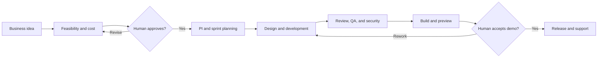
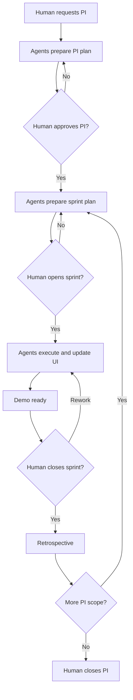
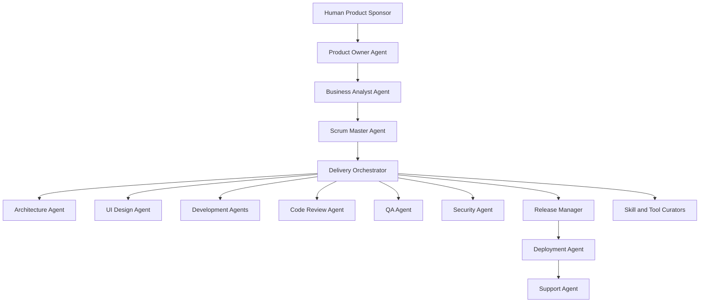
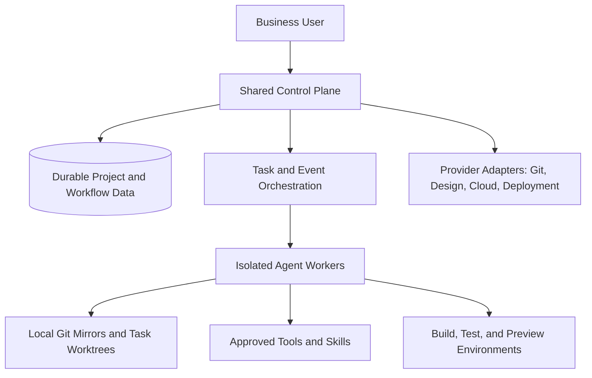

# IncrementPilot
## A Governed Multi-Agent Platform for Turning Business Ideas into Verified Software Increments

**Concise White Paper — Version 2.2**  
**Authors:** Deepak Kanwar and Krish Kanwar  
**DOI:** [10.5281/zenodo.21200236](https://doi.org/10.5281/zenodo.21200236)  
**Status:** Public technical white paper  
**Audience:** Business leaders, product owners, senior business analysts, architects, delivery leaders, and AI engineering teams

---

## Abstract

IncrementPilot is a governed multi-agent platform that transforms broad business ideas into feasible, costed, designed, tested, demonstrated, deployable, and supportable software products.

The platform orchestrates specialized Product Owner, Business Analyst, Scrum Master, Architecture, UI Design, Development, Code Review, QA, Security, Release, Deployment, Support, Skill Curator, and Tool Curator agents. These agents work through durable workflows, structured artifacts, isolated Git workspaces, quality gates, and explicit human approvals.

IncrementPilot is designed primarily for business-oriented users who understand the outcome they need but may not write production software. A user can submit an idea, review feasibility and cost, approve a Program Increment (PI), open a sprint, observe work continuously, review a live product demo, request rework, close the sprint, approve release, and guide support and future improvements.

The platform does not prescribe a fixed application stack. Its Architecture Agent recommends the simplest fit-for-purpose solution that reliably satisfies business, security, operational, scalability, cost, portability, and organizational requirements. Technologies shown in reference deployments are examples rather than platform requirements.

IncrementPilot treats each sprint as a viable product increment measured in **agent-days**. Human users control actual sprint opening and closing dates. Every important activity—requirements, designs, decisions, discussions, code, tests, defects, builds, deployments, demos, retrospectives, tools, and skills—is versioned and visible in the user interface.

IncrementPilot is not another coding assistant. It is a governed software-delivery operating system in which artifacts are authoritative, costs are visible, agents are bounded, and humans remain in control.

---

# 1. Why IncrementPilot

AI coding assistants can generate code quickly, but software delivery requires more than code generation. Most current tools optimize individual engineering tasks rather than govern the complete product lifecycle. Products fail when business needs remain ambiguous, architecture becomes unnecessarily complex, design and testing occur too late, decisions disappear into conversations, and stakeholders cannot verify progress until significant cost has already been incurred.

Autonomous agents create additional risks:

- Work may be duplicated or discarded.
- Agents may operate with excessive permissions.
- Different agents may change overlapping code.
- Token, build, and infrastructure costs may become unpredictable.
- Generated work may not be traceable to business requirements.
- Testing and security evidence may be incomplete.
- Human reviewers may see activity but not meaningful business progress.

IncrementPilot addresses these problems by managing the complete product lifecycle. It connects business objectives to requirements, designs, stories, code, tests, releases, and support history. It allows agents to perform bounded work while deterministic workflows and human gates control progression.

The product is intended to answer five questions continuously:

1. What business outcome are we pursuing?
2. What increment is being built now?
3. What evidence shows that the work is correct?
4. What decision is required from a human?
5. What has the work cost so far, and what is forecast next?

## 1.1 How IncrementPilot differs from a coding assistant

Coding assistants help an individual engineer implement or understand code. IncrementPilot governs the wider delivery system around that work. It does not replace coding tools; it coordinates them with business analysis, planning, design, traceability, quality, cost control, and human authority.

| Capability | Typical coding assistant | IncrementPilot |
|---|---:|---:|
| Generate or modify code | Yes | Yes, through bounded development agents |
| Business discovery and feasibility | Limited | Integrated |
| Requirements-to-release traceability | Limited | End to end |
| Human-controlled PI and sprint gates | No | Yes |
| Cross-role delivery orchestration | Limited | Product, design, engineering, QA, security, release, and support |
| Cost and agent-day forecasting | Limited | Planned and tracked throughout delivery |
| Production support lifecycle | Usually outside scope | Integrated through governed workflows |

---

# 2. Governed Product Lifecycle



*Figure 1. Core governed lifecycle.*

## 2.1 Idea and feasibility

A user begins with a broad requirement, problem statement, supporting documents, desired outcome, constraints, and budget expectations. The Business Analyst Agent creates an initial business understanding, while the Architecture Agent evaluates technical, data, integration, security, operational, and delivery feasibility.

The initial assessment includes:

- Problem and opportunity
- Target users and business processes
- Assumptions and open decisions
- Feasibility classification and confidence
- Architecture options
- Major risks and constraints
- Time to first usable increment
- Initial delivery and operating-cost ranges

The early cost estimate includes model-token usage, agent execution, tools, temporary environments, builds, tests, and a configurable uncertainty buffer. It is presented as a range with assumptions rather than as false precision.

## 2.2 Business case and approval

The Product Owner, BA, Architecture, and Scrum Master Agents prepare a concise business case containing expected value, product scope, recommended approach, PI roadmap, cost, risks, and measurable success criteria.

A human sponsor decides whether to proceed, revise, defer, or stop. Detailed delivery does not begin until the business case and architecture direction are accepted.

## 2.3 PI and sprint execution

A Program Increment defines a coherent business outcome delivered through one or more viable sprints. The PI plan identifies epics, dependencies, architectural milestones, design milestones, estimated agent-days, token budget, cost forecast, risks, and demo outcomes.

For each sprint, the Scrum Master Agent proposes the smallest coherent increment that can be demonstrated and evaluated. The human must approve and open the sprint. Agents then perform only the approved work.

## 2.4 Demonstration, acceptance, and learning

Agents may mark a sprint as demo-ready, but only a human can close it. The Demo Center presents the live product, delivered stories, acceptance evidence, defects, known limitations, cost, and agent-day usage.

After closure, agents conduct a retrospective covering quality, rework, duplicate effort, token consumption, build usage, tool effectiveness, and skill effectiveness. The next sprint cannot start until required retrospective actions are acknowledged.

## 2.5 Illustrative journey

A product owner at a financial-services organization uploads a description of a loan-approval process. The BA Agent identifies actors, rules, exceptions, and unresolved decisions. The Architecture Agent presents three fit-for-purpose options with cost and operational trade-offs, while the UI Design Agent prepares the initial user flow. After the sponsor approves the business case and PI plan, development and QA agents deliver a reviewable first increment. The sponsor tests the preview, requests one workflow change, and closes the sprint after rework is verified. The retrospective updates the next sprint plan before further delivery begins.

---

# 3. Human-Governed PI and Sprint Model



*Figure 2. Human-controlled PI and sprint cycle.*

## 3.1 Agent-days

IncrementPilot measures planned effort in agent-days rather than human working days. An agent-day is a configurable unit of execution capacity that may include a token allowance, runtime limit, tool allowance, build allowance, and retry budget.

A sprint might allocate capacity across product analysis, architecture, design, frontend, backend, QA, security, and deployment. Parallel agents can consume several agent-days during a short calendar period.

Calendar dates remain important, but they are recorded from actual human actions:

- `opened_at` is recorded when the human opens the sprint.
- `closed_at` is recorded when the human accepts and closes it.
- The interface displays planned and consumed agent-days alongside elapsed calendar time.

This distinguishes delivery capacity from arbitrary calendar ceremonies.

## 3.2 Human gates

Human approval is required for:

- Feasibility and business case
- Architecture direction
- PI activation
- Sprint opening and closure
- Material scope or budget changes
- Retrospective policy changes
- PI closure
- Production promotion
- High-risk operational actions

Agents prepare recommendations and evidence. They do not grant themselves authority.

## 3.3 Design principles

- **Human authority over autonomous execution**
- **Artifacts over conversations**
- **Evidence over assertions**
- **Simplicity over unnecessary complexity**
- **Reuse over reinvention**

---

# 4. Agent Operating Model



*Figure 3. Specialized agents coordinated by a governed orchestrator.*

Each role has a bounded responsibility:

- **Product Owner Agent:** maintains vision, value, roadmap, and priority recommendations.
- **Business Analyst Agent:** converts business intent into processes, rules, requirements, assumptions, and acceptance criteria.
- **Scrum Master Agent:** plans PI and sprint execution, manages dependencies and capacity, and facilitates reviews and retrospectives.
- **Delivery Orchestrator:** controls workflow state, dispatch, budgets, retries, and duplicate-work prevention.
- **Architecture Agent:** proposes multiple fit-for-purpose strategies and records trade-offs.
- **UI Design Agent:** creates and evolves Figma flows, screens, design tokens, accessibility guidance, and developer handoffs.
- **Development Agents:** implement approved work in isolated Git branches and worktrees.
- **Code Review Agent:** reviews diffs, architecture alignment, maintainability, migration safety, and test quality.
- **QA Agent:** creates test cases and scripts, runs verification, records defects, and independently verifies fixes.
- **Security Agent:** performs threat analysis, secret and dependency scanning, authorization review, and security gating.
- **Release Manager:** assembles release evidence and makes a go/no-go recommendation.
- **Deployment Agent:** performs controlled builds, migrations, deployment, health checks, and rollback.
- **Support Agent:** diagnoses incidents and executes only approved runbooks or hotfix workflows.
- **Skill and Tool Curators:** evaluate and publish reusable knowledge and executable capabilities.

Agents communicate through concise, structured handoffs. The platform records operational discussions and final decisions, but does not expose private model reasoning.

---

# 5. Architecture Principle: Fit for Purpose

The Architecture Agent recommends the least complex solution that reliably satisfies current business, functional, security, operational, and scalability requirements.

IncrementPilot does not prescribe a fixed application stack. The agent evaluates:

- Business criticality and expected usage
- Security and regulatory obligations
- Data consistency and volume
- Integration needs
- Availability and recovery expectations
- Delivery speed and organizational capabilities
- Operational support burden
- Cost and portability
- Existing enterprise standards

A suitable design may be a modular monolith with a relational database and containerized deployment. Another project may justify serverless services, event-driven architecture, mobile technologies, managed platforms, packaged enterprise software, data platforms, or a cloud-native topology.

Technologies such as Kubernetes, service meshes, streaming platforms, microservices, multiple databases, or multi-region infrastructure should be introduced only when they address a demonstrated requirement, risk, or approved growth scenario.

Every major choice records:

- The requirement it addresses
- Simpler alternatives considered
- Cost and operational implications
- Security and resilience implications
- Portability implications
- Conditions that justify future evolution

The preferred architecture is therefore not the smallest in absolute terms. It is the simplest architecture that is secure, supportable, fit for purpose, and capable of evolving when justified.

---

# 6. Platform Architecture and Isolation



*Figure 4. Provider-neutral control and execution architecture.*

IncrementPilot separates the control plane from the execution plane.

The control plane manages organizations, users, requirements, PIs, sprints, workflow state, approvals, budgets, artifacts, and audit history. Agent workers run generated code in isolated environments with task-scoped repositories, tools, permissions, runtime limits, and network policies.

The initial SaaS can use an organization-centered shared control plane with isolated execution paths. Enterprise options can later provide dedicated workers, customer-hosted runners, separate databases, or complete organization-specific installations.

Local Git mirrors improve speed and allow agents to work without a graphical IDE. Each task receives a separate branch and worktree. Git remains the authoritative source; local disks are execution caches, not the sole record of work.

The platform itself may initially be deployed using a simple reference topology such as a platform machine, an agent-worker machine, and managed MySQL. This is an implementation example, not a required architecture for generated products.

---

# 7. Visible Delivery and Traceability

IncrementPilot presents delivery as a business-facing control center rather than as an IDE-first experience.

The interface includes:

- Product idea and product brief
- Requirements and decisions
- Architecture options and records
- Figma designs and design versions
- PI and sprint plans
- Stories, tasks, dependencies, and agent ownership
- Agent activities and discussions
- Bugs, test cases, test scripts, and test runs
- Git branches, commits, pull requests, and code links
- Builds, environments, releases, and deployments
- Demo evidence and human approvals
- Retrospectives, costs, tools, skills, and support history

Every feature is traceable through a chain such as:

```text
Idea → Objective → Requirement → Story → Design → Task → Commit
→ Pull Request → Test → Build → Release → Demo → Acceptance → Support
```

The interface defaults to business summaries and allows technical users to drill into implementation evidence.

---

# 8. Quality, Security, and Cost Governance

A story is not complete because an agent reports completion. It requires appropriate evidence, including approved design where relevant, committed code, review, tests, security results, documentation, and healthy preview behavior.

A sprint is not complete until the human reviews a working increment and closes it.

Code-generation agents receive repository and test permissions rather than unrestricted cloud credentials. Privileged actions use controlled tools and short-lived, narrowly scoped identities. Developer agents cannot promote production; deployment agents cannot silently change business logic; support agents are read-only by default.

IncrementPilot continuously measures:

- Tokens and agent-days per accepted story
- Build and test activity
- Retry and rework rates
- Defects and escaped defects
- Reused versus duplicated work
- Infrastructure and external-service costs
- Forecast versus actual cost

These measurements inform sprint retrospectives and future estimates.

---

# 9. Skill and Tool Reuse

The Skill Registry stores reusable procedures such as requirements engineering, architecture analysis, testing patterns, deployment practices, and incident triage.

The Tool Registry stores executable capabilities such as repository search, Figma integration, Git worktree creation, pull-request creation, test execution, cost estimation, build automation, and deployment.

Each registered item has a version, owner, contract, compatible agents, permission requirements, risk classification, evaluation status, and usage history.

Tools and skills created while building IncrementPilot itself are not automatically trusted. They are sanitized, evaluated, reviewed, versioned, and then packaged into the SaaS runtime. This creates a governed learning loop without allowing customer-specific or unsafe behavior to spread across projects.

---

# 10. IncrementPilot as Its Own Pilot

IncrementPilot will be developed through the same process it offers customers.

The initial sequence is:

1. Build the business-facing UI, database, workflow states, and human gates.
2. Add Figma design collaboration and artifact traceability.
3. Add Git, test, defect, build, and code visibility.
4. Add isolated local agent execution and tool governance.
5. Use IncrementPilot to manage a real feature in its own repository.
6. Build, test, deploy, and demonstrate the next IncrementPilot version.
7. Require human approval before self-upgrade, with rollback protection.

This self-pilot is both an implementation strategy and a validation method. The product must demonstrate that its governance model works on its own development before it is trusted to manage customer products.

---

# 11. Expected Benefits and Evaluation

IncrementPilot is intended to improve:

- Time from idea to feasibility
- Time to first working demo
- Business visibility during delivery
- Requirement-to-release traceability
- Quality and test evidence
- Architecture discipline
- Cost forecasting
- Reuse of tools, skills, and components
- Safety of autonomous execution
- Human confidence in agent-driven development

Evaluation metrics include:

- Agent-days and tokens per accepted story
- Sprint and PI acceptance rates
- Defect and rework rates
- Reuse percentage
- Time waiting for human decisions
- Unauthorized-action attempts
- Rollback readiness
- Business outcome achievement
- User comprehension and satisfaction

---

# 12. Conclusion

IncrementPilot proposes a governed operating model for agent-assisted software delivery.

A business user begins with an idea, not a technical specification. Specialized agents assess feasibility, create a business case, design the product, plan viable increments, implement and verify the work, demonstrate it, deploy it, and support it. Humans retain authority over major transitions, while the platform maintains durable state, traceability, permissions, cost visibility, and evidence.

The central contribution is not the ability of an AI model to write code. It is the integration of business governance, product management, design, engineering, quality, security, release, deployment, support, and reusable learning into one transparent delivery system.

IncrementPilot is therefore best understood as a governed software-delivery operating system: agents do the detailed work, while humans remain informed, empowered, and in control.

---

## Suggested Citation

Kanwar, Deepak, and Krish Kanwar. *IncrementPilot: A Governed Multi-Agent Platform for Turning Business Ideas into Verified Software Increments*. Concise White Paper, Version 2.2, 2026. Zenodo. [10.5281/zenodo.21200236](https://doi.org/10.5281/zenodo.21200236).

## Disclaimer

This document presents a technical reference architecture and product concept. It does not constitute legal, financial, security, or professional engineering advice. Technologies, product names, and trademarks belong to their respective owners. This paper has not undergone formal academic peer review.

## Copyright and Licence

Copyright © 2026 Deepak Kanwar and Krish Kanwar.

This work is licensed under the Creative Commons Attribution 4.0 International Licence (CC BY 4.0). You may share and adapt the material for any purpose, provided appropriate credit is given, a link to the licence is included, and changes are indicated.

Licence: https://creativecommons.org/licenses/by/4.0/

This licence applies to the white paper and its accompanying diagrams. It does not grant rights to the IncrementPilot name, trademarks, software source code, confidential information, or third-party materials identified in the paper.
